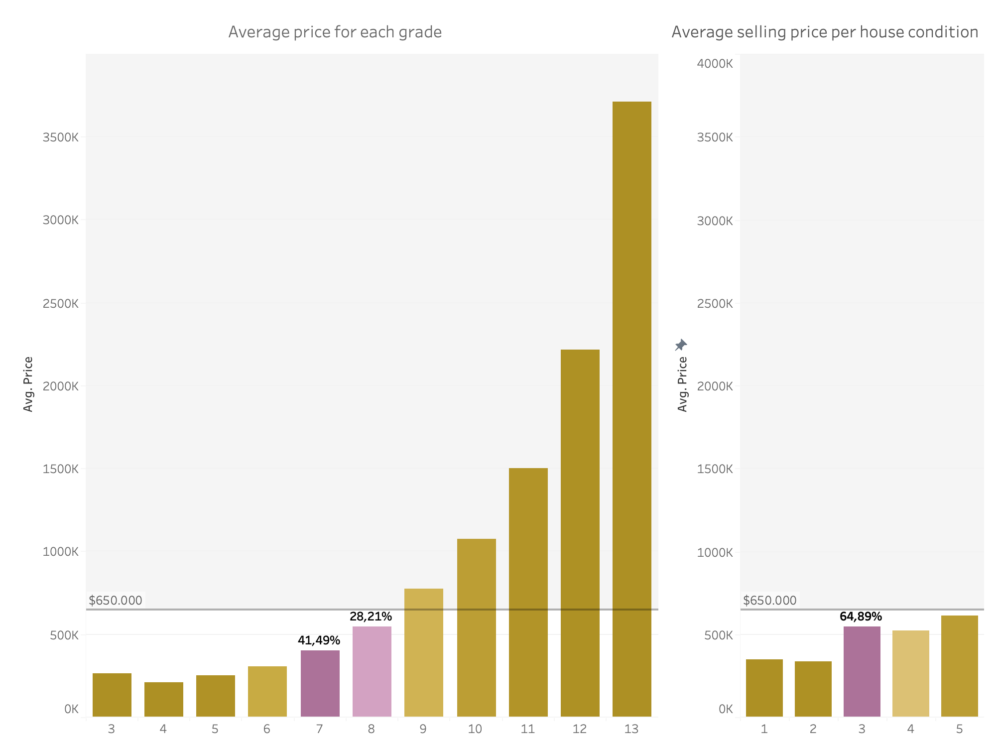

# REAL ESTATE REGRESSION ANALYSIS

The research presented aims to understand housing market trends in King County, Seattle (USA) using SQL, Tableau and Python to analyze data obtained from Kaggle (https://www.kaggle.com/datasets/harlfoxem/housesalesprediction), which includes 21 variables and 21596 observations:
 
- id
- date
- bedrooms
- bathrooms
- sqft_living
- sqft_lot
- floors
- waterfront
- view
- condition
- grade
- sqft_above
- sqft_basement
- yr_built
- yr_renovated
- zipcode
- lat
- long
- sqft_living15
- sqft_lot15
- price

TABLEAU LINK: https://public.tableau.com/views/RealEstateRegressionAnalysis/RealEstateRegressionAnalysis?:language=en-US&:display_count=n&:origin=viz_share_link

## 1.	UNDERSTANDING THE DATABASE WITH SQL
As a first approximation the database was studied using MySQL. A first look at the imported data shown the following:

To begin, information about number of bedrooms, bathrooms, number of floors, house conditions and grade was retrieved. Furthermore, information about the 10 most expensive houses was prompted, with the highest price set at $7,700,000.00, while the average price is $540,296.57. This first glimpse suggests a positive skewness in the dataset. 

The average price of houses depending on the number of bedrooms suggests three interesting things: 
1.	There is one house with 33 bedrooms and one house with 11 bedrooms, which suggests both values are data entry errors.
2.	The range of average price goes from $1,150,076.92 (8 bedrooms) to $318,239.46 (1 bedroom), with highest average price far from the most-expensive houses, which adds up to the possibility of outliers in the dataset.

3.	Most houses have either 3 or 4 bedrooms.

Regarding living area, data suggests that as number of bedrooms increases, the living room area increases as well, with a break in the tendency from 10 rooms onwards. To dig deeper into bedrooms', houses with 3 and 4 bedrooms were prompted as follows:

Data suggests as well that houses which have a waterfront view have an average price that triples houses with no waterfront and only 914 houses have been renovated.

To see if a relation exists between a house's condition and the grade assign to it exists, information about these variables was prompted, not showing a clear tendency between the variables.

NOTE1: information in this report is not in the same order as prompts in SQL file.

## 2.	VISUALIZING WITH TABLEAU
In this section, deeper analysis is going to be done for most relevant variables, starting with areas where average price is > $650,000 represented in pink tones (left figure). 

As shown, most expensive houses are located in the lake area to the west and north-west of King County, zipcode 98039 having the highest average price of $2,187,551. 

The right figure shows concentration of selling properties showing the central and western part of the county encompasses most of the housing market. 

The properties’ grade shows a positive trend regarding average price, meaning as grade increases average price increases as well. It is worth mentioning most houses have grade 7 or grade 8 (˜70%) and houses of grade 11 and onward represent less than 1% of total properties, so it is safe to say grade impacts average price, but the increase may not be equally significant given the underrepresentation of properties. 

In the case of properties’ condition (right figure) a clear tendency can’t be found regarding average price, but it is worth noticing that in no case the average price is above $650,000, which means properties of all price ranges can have conditions 1 to 5. 

As seen previously in the SQL analysis, properties with a waterfront tend to have higher average prices than properties without waterfronts. The following figures show that only ˜10% of the properties have views, and all of them have prices above $650,000, but only view 4 has a significant percentage (˜43%) if waterfronts. 

Regarding properties’ bedrooms and bathrooms the figure below deepens the analysis performed previously, showing the concentration of properties of 3 and 4 bedrooms (˜77%) with a positive relation to average price up until 8 bedrooms. In the case of bathrooms, most houses have between 1 and 2 bathrooms (˜90%), showing a positive relation to average price as well. 

Observing the distribution of different properties’ areas two things stand out: 
1.	There is a tendency for price to increase as square feet increases for ‘above’ area and ‘living area’, and
2.	For ‘basement’ and ‘lot’ areas as well, but there is also a tendency for average price to increase in the case of properties with no to very little squared feet in this two areas. This could mean there are other significant factor affecting price for such properties, and/or this properties have specific characteristics that should be further inquired (for example the possibility of them being departments).

NOTE: all tableau visualizations for this project can be found in: https://public.tableau.com/shared/6SZ3GWWR5?:display_count=n&:origin=viz_share_link

## 3. REGRESSION ANALYSIS WITH PYTHON
Three models were tested in order to better understand how different variables affect properties' price using python and statistical libraries: Ordinary Least Squares Regression (OLS), K-means Neighest Neighbours (KNN), and Multilayer Perception (MLP). 

As a first step, data was collected and revised, which included properties' ids, transactions' date, and properties specific features.

Since the data didn't present null values, unique values  and descriptive statistical information for numerical variables were checked. This general assumptions were noticed:

- Total number of entries (21597) doesn't match unique ids (21420). There are repeated id values.
- Unique values for bathrooms is high and range of values goes from 0,5 to 8. This indicateds mid values. 
- Waterfront variable only has two values, indicates categorical variable.

## Data Cleaning

Specific analysis was perfomed as follow:
1. Variable id: duplicates were eliminated taking into account most recent transaction date. The total number of entries is 21420.
2. Variable date was set to format datetime.
3. Variable yr_built was used to create new variable 'house_age'. 
4. Observations where bedroom values were 33 and 11 were eliminated since they were considered data entry mistakes. Dataset entries is 21418.
5. Variable waterfront was converted to categorical, since it already had values 1(property with waterfront) and 0 (property without waterfront).
6. Variable yr_renovated was used to create new categorical variable renovated_status: 1 for properties that had been renovated, 0 for properties that hadn't.
7. Variable zipcode was converted to categorical format to later on create dummy variables. 
8. Non-relevant variables were dropped from dataframe: 
    - id
    - date
    - sqft_living: sqft_living15 was used instead since it had updated, most recent values. 
    - sqft_lot: sqft_lot15 was used instead since it had updated, most recent values. 
    - yr_built
    - yr_renovated
    - lat: variable zipcode was used for location purposes
    - long: variable zipcode was used for location purposes

## EDA

### Numeric variables

For numerical variables, correlation was checked. Independent variables didn't show high enough correlations to be eliminated from the dataset (highest correlation was 0,76). Standard correlation to eliminate a variable is set at 0,9.

Distribution graphs were plotted to better understand numeric variables. Three main insights can be drawn from observed data: 

    a. Variables view, condition, and grade can be considered discrete ordinal variables. For the purpose of this study they are going to remain in numerical format.

    b. Variables bedrooms, bathrooms, sqft_above, sqft_basement,sqft_living15, sqft_lot15, and price present a positive skewness, indicating presence of outliers to the higher values. 

    c. As previously intuited, there is a high number of properties with 0 or near 0 values of sqft_basement and sqft_lot15.

Data for all variables regarding surface areas (sqft) and price was escalated in order to adjust for high magnitudes respect to other numerical variables. No outliers were eliminated since the second part of analysis correspond to higher priced properties. 

### Categorical variables

Dummy variables were created for features waterfront, renovated_status, and zipcode. A dataframe with a total of 83 columns remained: 

Barcharts were drawn for waterfront and renovated_status, showing unbalanced data in both cases.

Dataframe for model testing was created: data_model.

## MODELS

## General information:

- Significance level was set at 0,9 for OLS model, meaning p-values =< 0,1 were accepted.

- Dependent variable price is defined as 'y'
- Independent variables are defined as X_modeln, where n corresponds to dataframe used in each round of train-tests.

- Criteria for eliminating variables is determined by OLS results as follows: 
    1. Variables with p-values > 0,1, meaning variable is not in significant level.
    2. Variable (1) with highest Variance Inflation Factor (VIF), meaning variable presents high multicollineality.
This information can be found in 'ENHACE MODELS' section.
- A function was defined for each model using statsmodel library. 

- Test split is set at 0,25 for all models train-tests rounds. 

- For KNN models, number of neighbours (k1, k2, k3) was defined according to accuracy vs k Values performed for each train-test.

## Model comparison: 

OLS Regression models have the best performance among the three models, as it consistently has the lowest MSE, RMSE, and highest R-Squared values

The best performing model is OLS3:

For this model, the dataset of independent variables used included 72 variables after eliminating features from X_model1 according to:
- p-values >1: 'zip_98003', 'zip_98022', 'zip_98030', 'zip_98031', 'zip_98032', 'zip_98042', 'zip_98198', and floors.
- Highest VIF: sqft_above and bathrooms

Adjusted R-Squared is lower than previous OLS models since variables were eliminated considering significance level and multicollineality, which better reflects variables' imapct in the model.

- Mean Squared Error (MSE): measures the average squared difference between the predicted values and the actual target values. It gives an idea of how well the model is performing, with lower values indicating better performance. In this case, OLS3 has an MSE of 0.000565, which means the average squared difference between the predicted and actual values is relatively small.

- R-Squared: measures how well the model fits the data, with values ranging from 0 to 1. Higher R-squared values indicate a better fit, in OLS3, approximately 75.4% of the variance in the target variable can be explained by the predictor variables.

- Adjusted R-Squared: modified version of R-Squared that takes into account the number of independent variables. It penalizes the addition of irrelevant predictor variables that may artificially increase R-Squared. OLS3 has an Adjusted R-Squared of 0.750638, which means that the model's fit is good after considering the number of independent variables.

## OLS3 most relevant features: 

To identify most relevant features, variables from dataframe X_model3 were sorted by p-values (lowest to highest) and coefficients (lowest to highest), giving the following results: 

- 5 top zipcodes that have a positive relation to price
ZIPCODES    COEFFICIENTS 
zip_98039	0.178669
zip_98004	0.099936
zip_98112	0.072241
zip_98040	0.060260	
zip_98109	0.059408	

- Zipcodes with negative coefficients:
zip_98092	-0.005965
zip_98023	-0.005567

- Properties' features: 
waterfront	    0.090678
sqft_living15	0.068709
sqft_lot15	    0.049446
sqft_basement   0.032335

## Recommendations:

- Deal with unbalanced categorical data. 
- Eliminate outliers to enhace model performance and increase Adjusted R-Squared.
- Create new relevant variables that help the model.
- Group zipcode dummy variables with similar-price criteria to reduce overall number of variables in the model. 
- Further analysis could be performed using subsets for specific properties' characteristics, such as properties with/without waterfront, or properties that are houses (have a lot) versus those that don't and are more likely departments. 

## Analysis for properties with price >= $650,000

To further analyse variables that impact properties with prices higher or equal to $650,000, an OLS regression was performed using similar criteria as previus mdoels: 

- Data didn't show correlation among independent variables.
- VIF was checked and variable 'house_age' was eliminated. 
- Surface area variables and price were escalated. 

Model 4 Evaluation Metrics:
- MSE: 0.0010180335623765665
- RMSE: 0.03190663821803492
- R-squared: 0.727899537017693
- Adjusted R-squared: 0.7101966153296875

Most relevant features: 

- 5 top zipcodes that have a positive relation to price: 
    - ZIPCODE     COEFFICIENT
    - zip_98039	0.1449260
    - zip_98004	0.07802341
    - zip_98112	0.07664890
    - zip_98102	0.06618511
    - zip_98109	0.06055520
    
- 5 top zipcodes that have a negative relation to price:
    - ZIPCODE     COEFFICIENT
    - zip_98198	-0.09079601
    - zip_98023	-0.08584523
    - zip_98003	-0.07921427
    - zip_98178	-0.07401770
    - zip_98042	-0.06747588

- Features:
    - sqft_above	    0.3596616
    - sqft_basement   0.1175412
    - waterfront      0.1141935
    - sqft_living15   0.02132949
